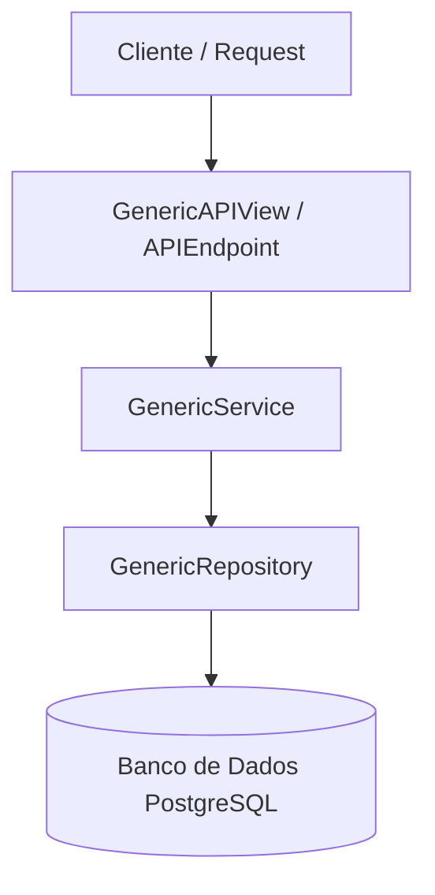

# 📖 Documentação da Arquitetura - FastAPI Minimal (fast-api-min)

Este documento provê uma visão aprofundada dos padrões de design, camadas de abstração orientadas a objetos (Class-Based) e soluções de segurança implementadas neste projeto.

---

## 🏗️ Padrões e Camadas Generics

A base de abstração está localizada em [app/core/generics/](file:///e:/GitHub/fast-api-min/app/core/generics/). Ela define um ciclo limpo de dados e regras de negócio:



### 1. Repositório Genérico (`GenericRepository`)
O repositório ([repository.py](file:///e:/GitHub/fast-api-min/app/core/generics/repository.py)) encapsula todas as operações de persistência com o banco PostgreSQL de forma puramente assíncrona. Ele recebe a sessão do SQLAlchemy e o modelo mapeado.
- Métodos expostos: `get()`, `list()`, `create()`, `update()`, `delete()`.
- Suporte a `auto_commit=True` para persistência direta.

### 2. Serviço Genérico (`GenericService`)
A camada de serviço ([service.py](file:///e:/GitHub/fast-api-min/app/core/generics/service.py)) isola as regras de negócio da infraestrutura. As validações complexas, checagens de integridade e orquestração residem aqui. 
- Ele trata a inexistência de registros levantando a exceção `NotFoundError`, que é tratada de forma transparente e uniforme a nível global.

### 3. Views Genéricas e Automação de Rotas (`GenericAPIView`)
A classe [GenericAPIView](file:///e:/GitHub/fast-api-min/app/core/generics/views.py#L138) estende o conceito de um *ModelViewSet* e automatiza a geração das cinco rotas CRUD padrão:
1. `GET /` - Listar registros com suporte a paginação.
2. `POST /` - Criar um novo registro.
3. `GET /{id}` - Buscar um registro específico.
4. `PATCH /{id}` - Atualizar campos de um registro.
5. `DELETE /{id}` - Excluir um registro.

- **Injeção Automática de Dependência de Serviço**:
  `GenericAPIView` analisa as propriedades `service_class` e `repository_class` declaradas no módulo e monta de forma genérica a dependência injetada por parâmetro no FastAPI.
- **Hook de Customização**:
  Qualquer classe filha pode sobrescrever `extra_routes(self, router, service_dep)` para acoplar rotas personalizadas além do CRUD padrão.

---

## 🔐 Controle de Acesso e Segurança

### 1. Controle de Acesso Baseado em Regras (RBAC)
No modelo `User`, implementamos a verificação recursiva de permissões:
- **Superusuário**: Se `is_superuser` for verdadeiro, o acesso é concedido de forma automática.
- **Permissões Granulares**: O método `has_permission(codename)` realiza a busca na relação Many-to-Many de permissões diretas atribuídas ao usuário (`user_permissions`) e também nas permissões herdadas através dos seus grupos (`groups -> permissions`).

No `GenericAPIView`, cada requisição CRUD é avaliada contra a regra do modelo:
- Leitura (`GET`): Exige permissão `view_<model>` (ex: `view_group`).
- Escrita (`POST`): Exige permissão `add_<model>`.
- Alteração (`PATCH`): Exige permissão `change_<model>`.
- Exclusão (`DELETE`): Exige permissão `delete_<model>`.

### 2. Mixins de Acesso Reutilizáveis
Para endpoints baseados em classe (`APIEndpoint`), as checagens de autorização são resolvidas via MRO (Method Resolution Order) utilizando os mixins em [mixins.py](file:///e:/GitHub/fast-api-min/app/core/mixins.py):
- **`LoginRequiredMixin`**: Garante que a requisição tenha um cabeçalho de autenticação válido e um usuário autenticado ativo.
- **`StaffRequiredMixin`**: Restringe o endpoint a usuários que possuem `is_staff` ou `is_superuser`.
- **`AdminRequiredMixin`**: Restringe o endpoint unicamente a superusuários (`is_superuser`).

---

## 🪄 Geração Dinâmica de Schemas (`@crud_schemas`)

Para eliminar a repetição maçante de declarar três esquemas diferentes no Pydantic para cada tabela, implementamos o decorador de classe [@crud_schemas](file:///e:/GitHub/fast-api-min/app/core/generics/schemas.py#L20) em [schemas.py](file:///e:/GitHub/fast-api-min/app/core/generics/schemas.py).

Quando você decora uma classe base de campos:
```python
@crud_schemas
class PermissionBase(BaseModel):
    name: str
    codename: str
```
O decorador cria em tempo de execução três novas classes expostas como atributos da classe base:
- `PermissionBase.Create`: Usado para validação do payload de criação.
- `PermissionBase.Update`: Usado para validação de payloads de atualização parciais (todos os campos originais se tornam opcionais e com valor padrão `None`).
- `PermissionBase.Read`: Usado para serialização das saídas de leitura, injetando automaticamente as propriedades de banco `id`, `created_at` e `updated_at`.

---

## ⚡ Tratamento de Força Bruta (Rate Limiting)

Implementamos um limitador de requisições de login robusto em [middlewares.py](file:///e:/GitHub/fast-api-min/app/core/middlewares.py#L151) usando Redis:
- **Sliding Window**: Rate limit global por IP de cliente usando scripts Lua avaliados no Redis de forma atômica.
- **Progressive Backoff**:
  Quando um usuário falha na autenticação consecutivamente no endpoint `/login`:
  - O IP do cliente e o e-mail são incrementados no Redis.
  - A partir de 5 tentativas malsucedidas, o IP e o e-mail são temporariamente bloqueados por períodos progressivos (1 minuto, 5 minutos, 15 minutos, até 1 hora).
  - Ao realizar uma autenticação bem-sucedida, as chaves e os bloqueios são limpos atomaticamente através de `LoginRateLimiter.reset`.

---

## 🛠️ Ferramenta CLI de Inicialização (`cli.py`)

Para sementação e provisionamento seguro do banco de dados, implementamos um utilitário CLI interativo utilizando `typer`:
- **`createsuperuser`**: Solicita interativamente as credenciais (Email, Nome Completo e Senha). Executa validações de formato de e-mail, comprimento de senha, confirmação de senha segura e impede a duplicação se o e-mail já estiver cadastrado. Cria o usuário com flags `is_superuser = True` e `is_staff = True`.
- **`seed-permissions`**: Varre as tabelas de domínio e insere de forma atômica as permissões básicas CRUD (`view_user`, `add_user`, etc.) caso elas não existam no banco.

---

## 📈 Rota de Diagnóstico (`HealthCheckEndpoint`)

No arquivo [health.py](file:///e:/GitHub/fast-api-min/app/api/v1/health.py), implementamos o endpoint `/health` de forma orientada a objetos herdando de `APIEndpoint`. Ele testa em tempo real:
1. Conectividade com o **PostgreSQL** rodando `SELECT 1`.
2. Conectividade com o **Redis** enviando um `ping()`.

Caso qualquer serviço esteja indisponível, retorna `503 Service Unavailable` com o detalhamento dos erros. Caso contrário, retorna `200 OK`.

---

## 🧪 Suíte de Testes com Pytest

Configuramos uma estrutura robusta de testes sob `/tests`:
- [conftest.py](file:///e:/GitHub/fast-api-min/tests/conftest.py): Disponibiliza uma fixture assíncrona de `httpx.AsyncClient` configurada com `ASGITransport` que aponta para o app principal do FastAPI, permitindo testar rotas sem a necessidade de inicializar um servidor socket TCP local.
- [test_auth.py](file:///e:/GitHub/fast-api-min/tests/test_auth.py): Realiza testes automatizados das rotas principais (`/`, `/health`, autenticação `/login` e bloqueio de rotas `/me`).

