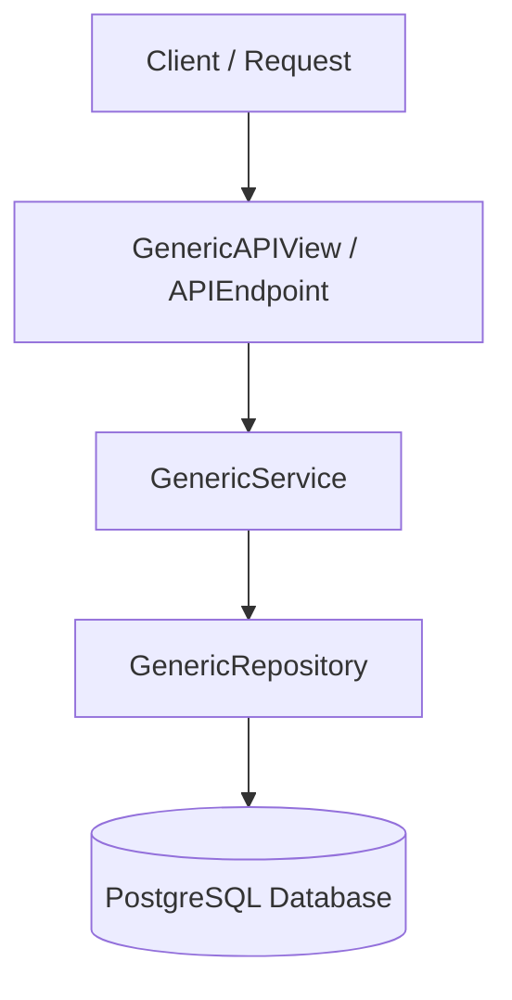

# Architecture Documentation - FastAPI Minimal (fast-api-min)

[Versão em Português (DOCUMENTATION_PT.md)](DOCUMENTATION_PT.md)

This document provides a deep dive into the design patterns, object-oriented (Class-Based) abstraction layers, and security systems implemented in this project.

---

## Architecture Abstractions and Generic Layers

The core abstraction layer is located under [app/core/generics/](file:///e:/GitHub/fast-api-min/app/core/generics/). It defines a clean data flow and separates concern layers:



### 1. Generic Repository (`GenericRepository`)
The repository ([repository.py](file:///e:/GitHub/fast-api-min/app/core/generics/repository.py)) encapsulates all data persistence operations with PostgreSQL asynchronously. It accepts the SQLAlchemy session and the target model.
- Exposed methods: `get()`, `list()`, `create()`, `update()`, `delete()`.
- Supports transactional lifecycle control with `auto_commit` toggling.

### 2. Generic Service (`GenericService`)
The service layer ([service.py](file:///e:/GitHub/fast-api-min/app/core/generics/service.py)) isolates domain business logic from infrastructural databases. Complex validation rules, business invariants, and orchestration reside here.
- It translates database-level issues (like missing records) into high-level application exceptions (`NotFoundError`), which are intercepted globally.

### 3. Generic Views & Route Automation (`GenericAPIView`)
The [GenericAPIView](file:///e:/GitHub/fast-api-min/app/core/generics/views.py#L138) class acts as an extensible *ModelViewSet*, automatically registering the five standard RESTful CRUD endpoints:
1. `GET /` - Paginated resource listing.
2. `POST /` - Resource creation.
3. `GET /{id}` - Get resource detail by UUID.
4. `PATCH /{id}` - Partial resource updates.
5. `DELETE /{id}` - Resource deletion.

- **Dynamic Dependency Resolution**:
  `GenericAPIView` reads target `service_class` and `repository_class` variables to dynamically resolve and inject required services into FastAPI routes.
- **Extension Hooks**:
  Classes extending `GenericAPIView` can override `extra_routes(self, router, service_dep)` to hook additional custom endpoints into the router.

---

## Authorization & Security

### 1. Role-Based Access Control (RBAC)
The `User` model defines permission validation logic:
- **Superuser**: If `is_superuser` is True, access is automatically allowed globally.
- **Granular Permissions**: The `has_permission(codename)` method queries direct permissions (`user_permissions`) and inherited permissions through groups (`groups -> permissions`) recursively.

Inside `GenericAPIView`, access is validated per HTTP method:
- Read (`GET`): Requires `view_<model>` permission (e.g., `view_group`).
- Write (`POST`): Requires `add_<model>` permission.
- Edit (`PATCH`): Requires `change_<model>` permission.
- Delete (`DELETE`): Requires `delete_<model>` permission.

### 2. Reusable Mixins
For endpoints using `APIEndpoint`, authorization checks are resolved via Method Resolution Order (MRO) using mixins in [mixins.py](file:///e:/GitHub/fast-api-min/app/core/mixins.py):
- **`LoginRequiredMixin`**: Ensures the request carries a valid Bearer token and a verified active user.
- **`StaffRequiredMixin`**: Restricts the endpoint to users with `is_staff` or `is_superuser` enabled.
- **`AdminRequiredMixin`**: Restricts the endpoint exclusively to superusers (`is_superuser`).

---

## Dynamic Schema Generation (`@crud_schemas`)

To eliminate the redundancy of manual schema declaration, we implemented the [@crud_schemas](file:///e:/GitHub/fast-api-min/app/core/generics/schemas.py#L20) class decorator in [schemas.py](file:///e:/GitHub/fast-api-min/app/core/generics/schemas.py).

When decorating a base schema:
```python
@crud_schemas
class PermissionBase(BaseModel):
    name: str
    codename: str
```
The decorator automatically creates three nested sub-schemas dynamically:
- `PermissionBase.Create`: Used for input payloads during resource creation.
- `PermissionBase.Update`: Makes all fields optional for partial updates.
- `PermissionBase.Read`: Injects database columns (`id`, `created_at`, `updated_at`) and handles ORM mapping.

---

## Brute-Force Rate Limiting

We implemented a robust login rate limiter in [middlewares.py](file:///e:/GitHub/fast-api-min/app/core/middlewares.py#L151) leveraging Redis:
- **Sliding Window**: Client IP-based rate limiting evaluated atomically via Redis Lua scripts.
- **Progressive Backoff**:
  When a user fails password authentication consecutively at `/login`:
  - Redis increments failures counters for both client IP and email.
  - From 5 failures onward, blocks are applied progressively (1 minute, 5 minutes, 15 minutes, up to 1 hour lockouts).
  - Upon a successful login, the lockout states are reset automatically through `LoginRateLimiter.reset`.

---

## Management CLI (`cli.py`)

For bootstrapping new environments, we built an interactive CLI utility in [cli.py](file:///e:/GitHub/fast-api-min/cli.py):
- **`createsuperuser`**: Prompts the developer for email, name, and password with double entry validation and database duplicate checks.
- **`seed-permissions`**: Scans domain models to populate standard CRUD permissions inside the database.

---

## Health Check and Diagnostics

The `HealthCheckEndpoint` in [health.py](file:///e:/GitHub/fast-api-min/app/api/v1/health.py) provides real-time infrastructure diagnostics:
1. Tests **PostgreSQL** connectivity running a `SELECT 1` query.
2. Pings the **Redis** cache.

If any check fails, the API returns a detailed `503 Service Unavailable` report, facilitating container monitoring in staging or production environments.
